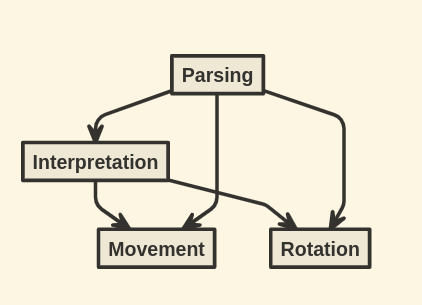

# RoverJS

Rover Challenge implementation using Node

## How to run the project?

1. Clone the repository

    <code>git clone https://github.com/Andrelpoj/RoverJS.git</code>

2. Navigate to the repository folder

    <code>cd RoverJS</code>

3. Build the docker image

    <code>docker build . -t roverjs</code>

4. Copy the wanted file to input

    <code>cp origin_path ./input </code>

5. Run docker container passing the desired input as following

    <code>docker run -it -v $(pwd)/input:/app/input roverjs input/test.txt</code>

## How to run project tests?

To run the tests you must have Node v18.14.2 installed.

1. Inside the project folder run, install dependencies:

    <code>npm install</code>

2. Run the tests

    <code>npm run test</code>

## Project Organization

The project has 4 modules necessary to run the program, the dependencies are represented in the following image:

Movement: Defines possible rover movements
Rotation: Defines possible rover rotations
Interpretation: Defines the instructions interpretation language and calls Movement and Rotation
Parsing: Parses strings and calls Interpretation

## Decisions

I've decided to make an MVP of the project first and then keep refactoring and evolving it.

I started with Javascript and then added Typescript to have type validations while developing.

After writing a more functional approach, I've realized that Typescript casting and Union Types didn't worked as I previously thought.
So I had to use patterns like: discriminated unions to deal with error handling and constant arrays to guard against invalid values for Union types castings.

## Possible Improvements

1. More tests (e2e tests, bigger test coverage, etc)
2. Expand to have more Movement and Rotation possibilities
3. Generating persistent logs instead of only using console.log
